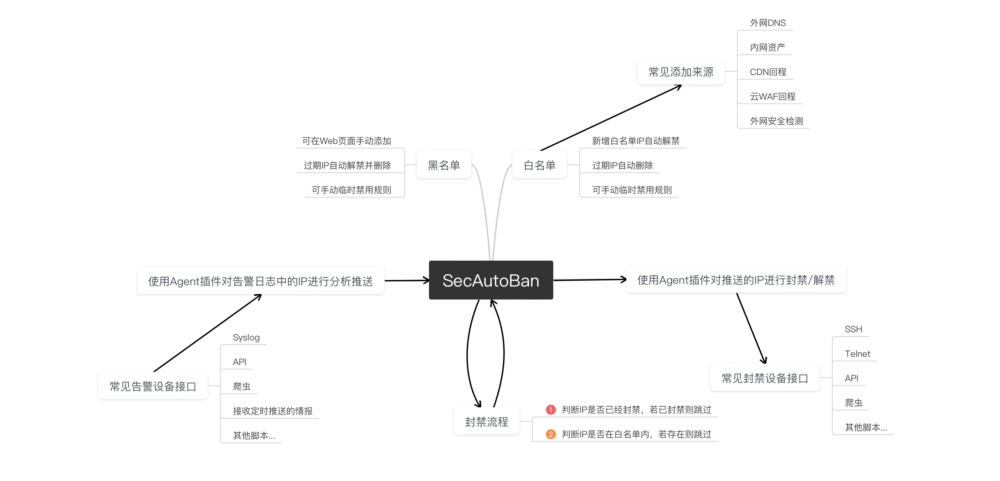
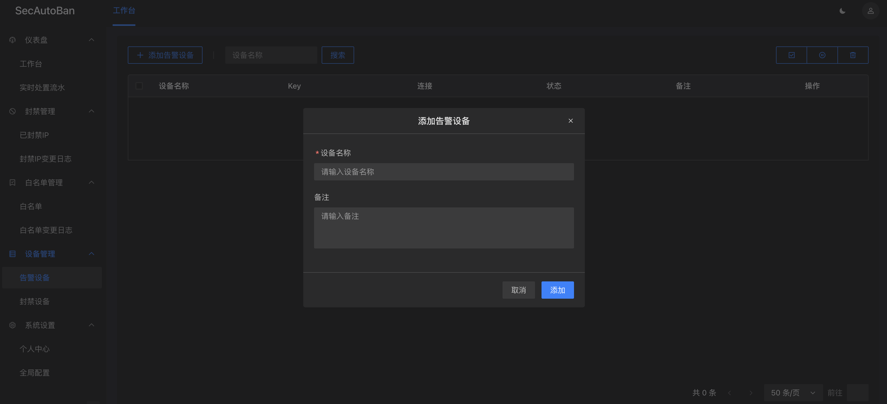
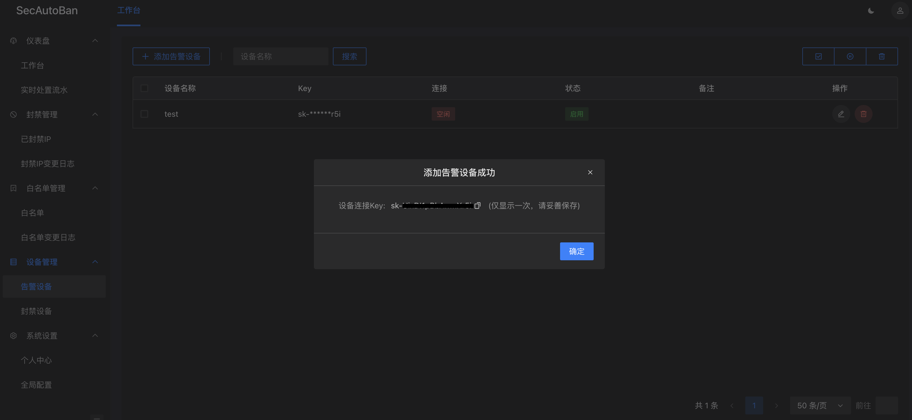
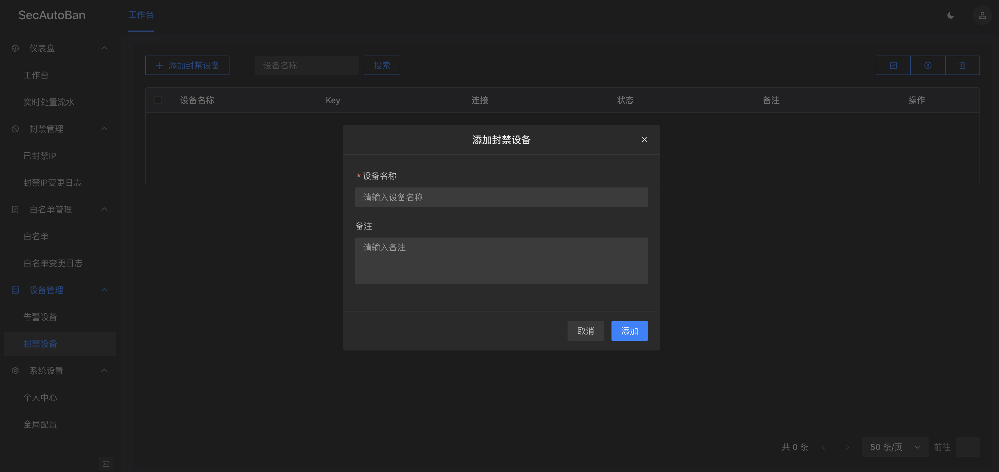

# SecAutoBan
安全设备告警IP全自动封禁平台，支持百万IP秒级分析处理。


封禁流水：


# 开始使用

平台分为三大模块，分别为：告警日志解析处理模块、核心处理模块、IP封禁/解禁模块。

其中，告警模块处理的IP会传入核心模块，核心模块会对IP进行去重过滤等处理，处理后IP会发送到封禁模块进行封禁。

具体流程思维导图如下：



## 核心模块安装
```shell
mkdir SecAutoBan && cd SecAutoBan
wget https://raw.githubusercontent.com/sec-report/SecAutoBan/main/run.sh
chmod +x run.sh
./run.sh

# 停止
./run.sh stop

# 更新
./run.sh update
```

Docker全部运行后访问 [http://127.0.0.1/](http://127.0.0.1/) 访问管理后台，初始化管理员账号

## 告警模块使用
首先在管理后台添加告警设备：



添加设备后，复制设备连接Key。（注意：设备连接Key仅显示一次，请妥善保存）



使用获得的设备Key运行告警模块，具体使用详情请跳转至：[device/alarm](./device/alarm) 查看。

目前仓库中仅有少量模版，未适配的设备只需手动实现一个函数。对于通用类设备，欢迎适配后提起PR推送至`device/alarm`目录，方便其他人使用。

## 封禁模块使用
首先在管理后台添加封禁设备：



添加设备后，复制设备连接Key。（注意：设备连接Key仅显示一次，请妥善保存）


使用获得的设备Key运行封禁模块，具体使用详情请跳转至：[device/block](./device/block) 查看。

目前仓库中仅有少量模版，未适配的设备只需手动实现两个函数。对于通用类设备，欢迎适配后提起PR推送至`device/block`目录，方便其他人使用。

## 告警/封禁模块列表

> 现有模块如下，实时更新中

| 告警模块  | 封禁模块 |
| ------------- | -------- |
| [长亭WAF社区版](./device/alarm/chaitin_waf_ce) | [旁路阻断](./device/block/tcp_reset) |
| [微步蜜罐HFish](./device/alarm/threatbook_hfish) | [OPNsense](./device/block/opnsense) |
| [奇安信天眼](./device/alarm/qianxin_skyeye) |[RouterOS](./device/block/router_os) |
| [奇安信椒图](./device/alarm/qianxin_jowtolock) | [CheckPoint](./check_point) |
| [绿盟WAF](./device/alarm/nsfocus_waf) |  |
| [科来网络安全分析审计系统](./device/alarm/kelai_wangluoanquanfenxishenjixitong) |  |


## 黑/白名单说明

* 黑名单就是已经封禁的IP，已封禁的IP都可以在该列表查询到。如果设置了有效期，到期后会自动解禁、删除。
* 新增白名单时会回溯一遍已经封禁的IP，若IP已经封禁会立即封禁，并从黑名单中删除。
* 手动添加IP至黑名单时，会自动对IP进行：格式校验、去重、对比白名单等操作。若添加IP后，平台提示新增的IP比实际填写的IP数量少，属于正常情况，可能已被过滤。

## 网络连接说明

* 核心模块：核心模块不会主动发起TCP连接，只需模块和管理机器能访问Web端口即可。
* 告警模块：如需监听Syslog请打开安全设备到告警模块对应UDP端口，同时告警模块需要正向访问核心模块Web端口（`WebSocket`通讯）。
* 封禁模块：封禁模块无需监听任何端口，只需要正向访问核心模块Web端口（`WebSocket`通讯），及需要连接的封禁设备即可。

## 沟通群

> 请加好友并备注：`SecAutoBan加群`


## 公众号

> 关注微信公众号: `信息安全报告`，更新会第一时间推送


## 其他作品

[SecReport](https://github.com/sec-report/SecReport)：ChatGPT加持的，多人在线协同信息安全报告编写平台。

## Star History

<a href="https://github.com/sec-report/SecAutoBan/stargazers">
    
</a> 
