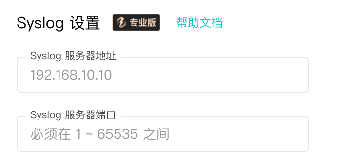
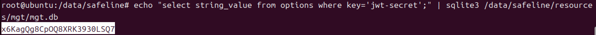
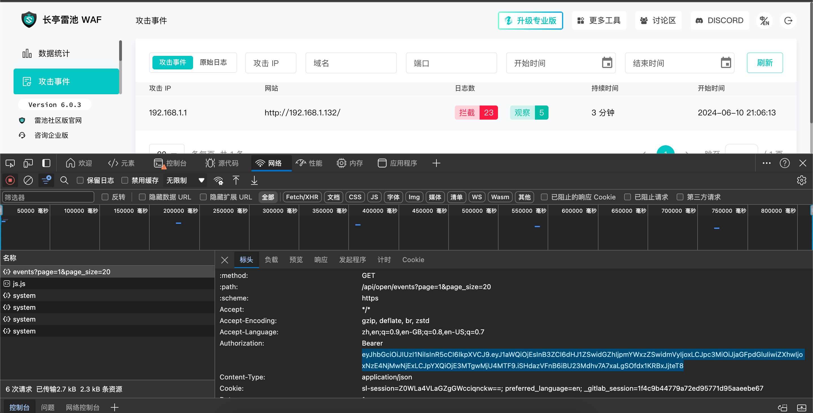

# 长亭WAF社区版

长亭WAF社区版非专业版没有Syslog权限，采用前端轮询的方式获取告警数据。



## 配置说明

### 安装依赖

```
pip3 install pycryptodome websocket-client requests PyJWT
```

### 配置模块

#### 修改回连核心模块配置

更改脚本第`156`-`158`行

```
server_ip = "127.0.0.1"
server_port = 8080
sk = "sk-xxx"
```

#### 修改与WAF连接的地址

更改脚本第`159`行

```
chaitin_waf_url = "https://xxx.xxx.xxx.xxx:9443"
```

#### 修改登录配置

WAF登录方案分为三种，适配不同情况。

##### 方案一: 能登录长亭WAF主机shell的情况（永久使用，推荐）

在WAF主机上执行以下命令获取JWT密钥，用于自动登录：

```shell
echo "select string_value from options where key='jwt-secret';" | sqlite3 /data/safeline/resources/mgt/mgt.db
```



> 若提示没有sqlite3，请手动安装，例如ubuntu为: `apt install -y sqlite3`。

> `/data/safeline`为长亭WAF默认安装目录，若存放在其他地方请修改。

拿到JWT密钥后填入脚本第`161`行

```
chaitin_waf_login_conf = {
    "jwt-secret": "xxxxxxx",  # <-填写这个字段
    "username": "",
    "password": "",
    "bearer": "xxx.xxx.xxx"
}
```

> 优先识别jwt-secret，其他字段留空即可

##### 方案二: 前端登录（永久有效，不支持TOTP）

将用户名密码填入脚本第`162`-`163`行

```
chaitin_waf_login_conf = {
    "jwt-secret": "",
    "username": "",  # <-填写这个字段
    "password": "",  # <-填写这个字段
    "bearer": "xxx.xxx.xxx"
}
```

##### 方案三: 前端登录，有TOTP令牌的情况（7天有效，到期需人工更新Token）

登录WAF后，F12打开开发者工具，复制浏览器中任意网络连接请求头中`Authorization`字段`Bearer`下面的字符串



拿到Token后填入脚本第`164`行

```
chaitin_waf_login_conf = {
    "jwt-secret": "",
    "username": "",
    "password": "",
    "bearer": "xxx.xxx.xxx"  # <-填写这个字段
}
```

## 运行

```shell
python3 chaitin_waf_ce.py
```
