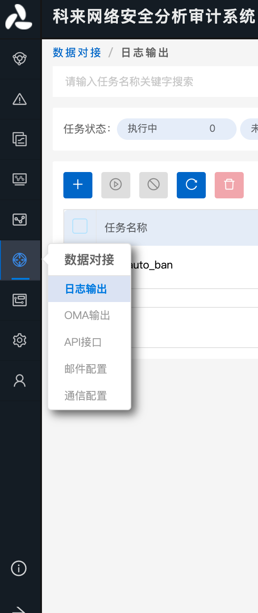
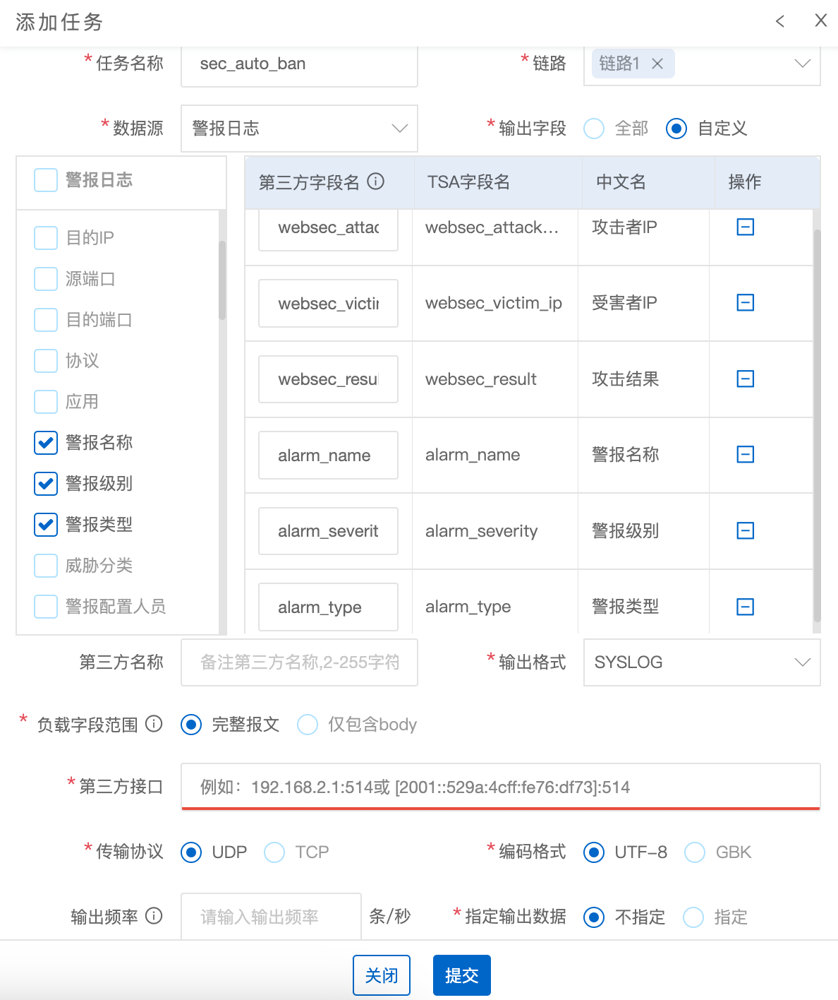
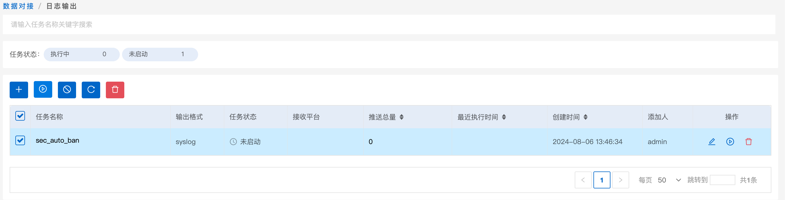

# 科来网络安全分析审计系统

## 下载模块

```
wget https://raw.githubusercontent.com/sec-report/SecAutoBan/main/device/alarm/kelai_wangluoanquanfenxishenjixitong/kelai_wangluoanquanfenxishenjixitong.py
```

## 配置说明

### 配置科来网络安全分析审计系统

科来网络安全分析审计系统支持外发syslog，通过`数据对接`-`日志输出`，配置syslog服务。



新增一条配置，配置参数如图所示



配置完成后需点击启用



### 安装依赖

```
pip3 install SecAutoBan ipaddress
```

### 配置模块

#### 修改回连核心模块配置

更改脚本第`45`-`47`行

```
server_ip = "127.0.0.1",
server_port = 80,
sk = "sk-xxx",
```

#### 配置syslog监听地址

更改脚本第`42`行，请与天眼SYSLOG中配置的端口一致

```
listen_syslog_udp_port = 567
```

## 运行

```shell
python3 kelai_wangluoanquanfenxishenjixitong.py
```