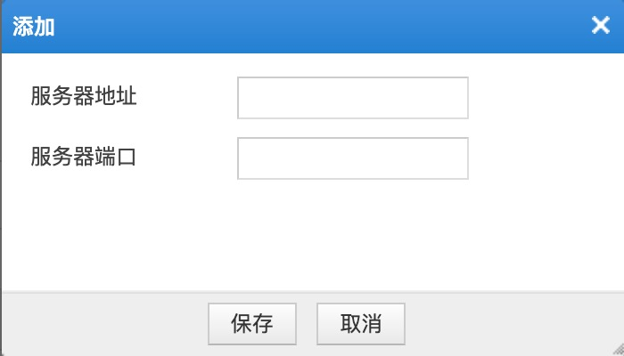

# 绿盟WAF

## 下载模块

```
wget https://raw.githubusercontent.com/sec-report/SecAutoBan/main/device/alarm/nsfocus_waf/nsfocus_waf.py
```

## 配置说明

### 配置WAF

登录WAF后台，通过`日志报表`-`日志管理配置`-`Syslog配置`，添加服务器。


IP填写本模块运行的主机IP，端口可自定义配置：



配置完成点击保存即可。

### 安装依赖

```
pip3 install SecAutoBan
```

### 配置模块

#### 修改回连核心模块配置

更改脚本第`40`-`42`行

```
server_ip = "127.0.0.1",
server_port = 8080,
sk = "sk-xxx",
```

#### 配置syslog监听地址

更改脚本第`38`行，请与SYSLOG中配置的端口一致

```
listen_syslog_udp_port = 567
```

## 运行

```shell
python3 nsfocus_waf.py
```

