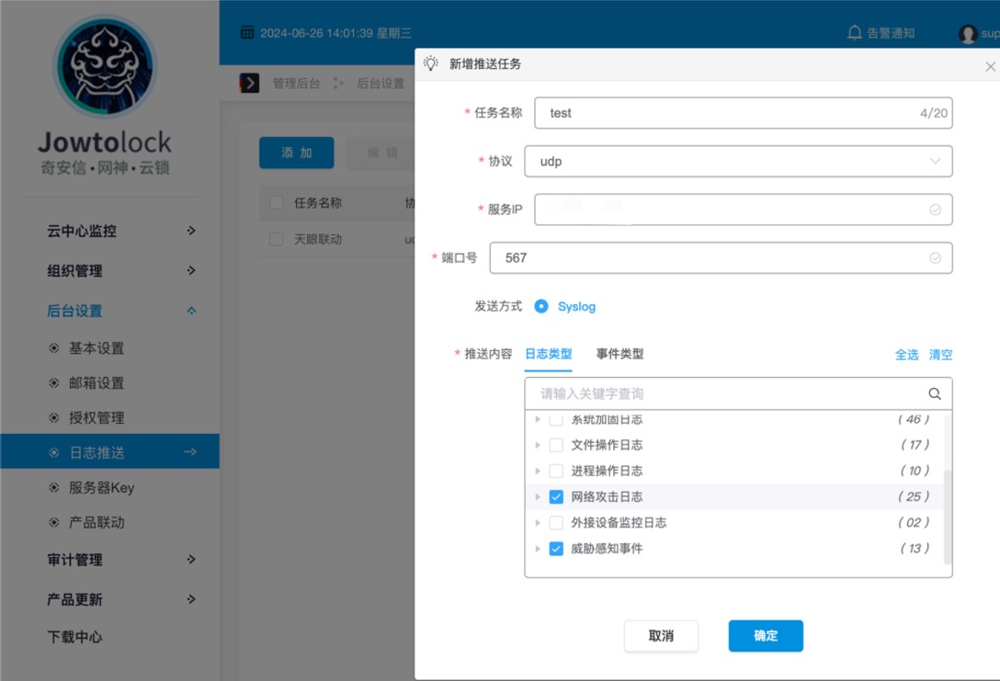
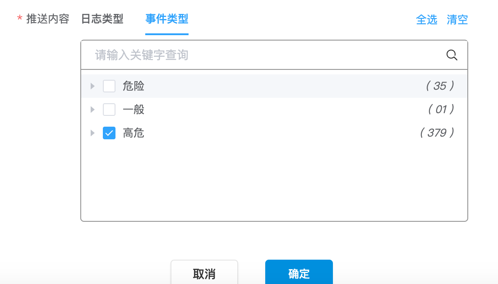

# 奇安信椒图

## 下载模块

```
wget https://raw.githubusercontent.com/sec-report/SecAutoBan/main/device/alarm/qianxin_jowtolock/qianxin_jowtolock.py
```

## 配置说明

### 配置天眼

椒图外发syslog需要登录superadmin账号，登录后通过`后台设置`-`日志推送`，添加推送任务。

日志类型选择`网络攻击日志`、`威胁感知事件`



时间类型选择高危：



配置完成点击确定即可。

### 安装依赖

```
pip3 install SecAutoBan
```

### 配置模块

#### 修改回连核心模块配置

更改脚本第`36`-`38`行

```
server_ip = "127.0.0.1",
server_port = 80,
sk = "sk-xxx",
```

#### 配置syslog监听地址

更改脚本第`33`行，请与椒图SYSLOG中配置的端口一致

```
listen_syslog_udp_port = 567
```

## 运行

```shell
python3 qianxin_jowtolock.py
```