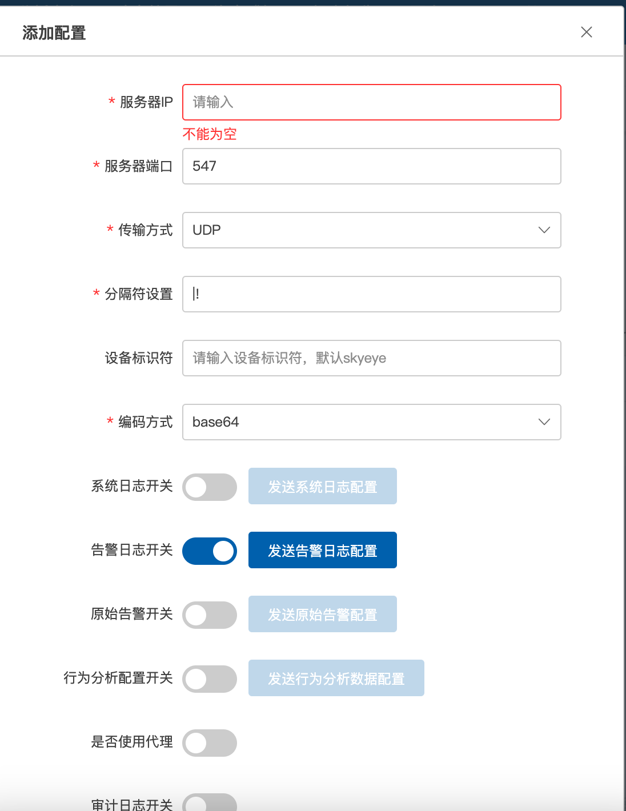
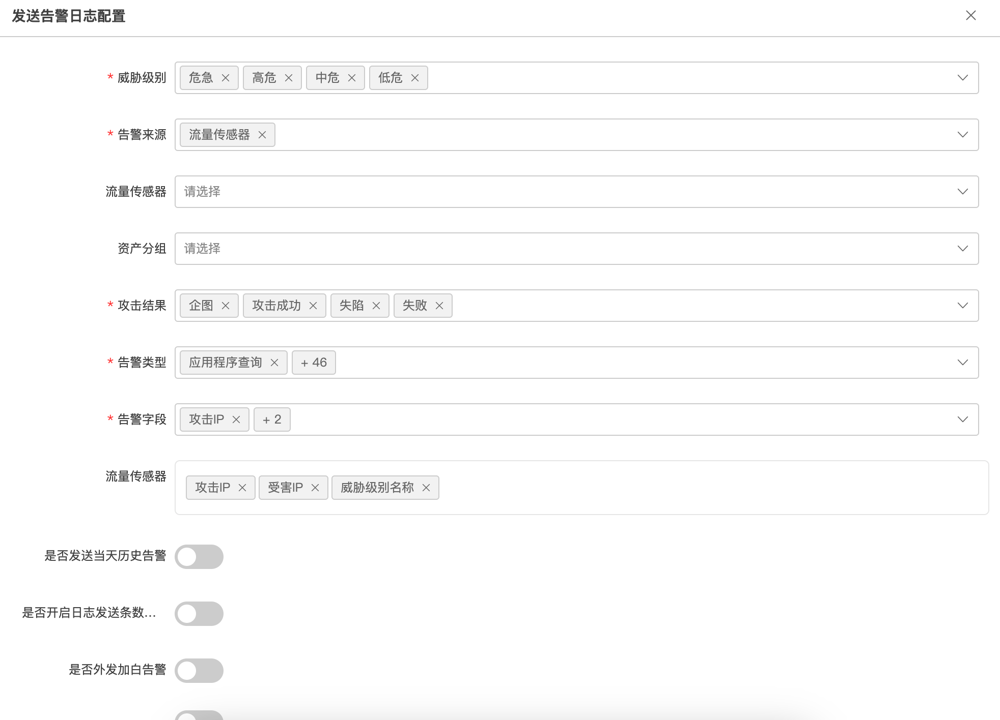
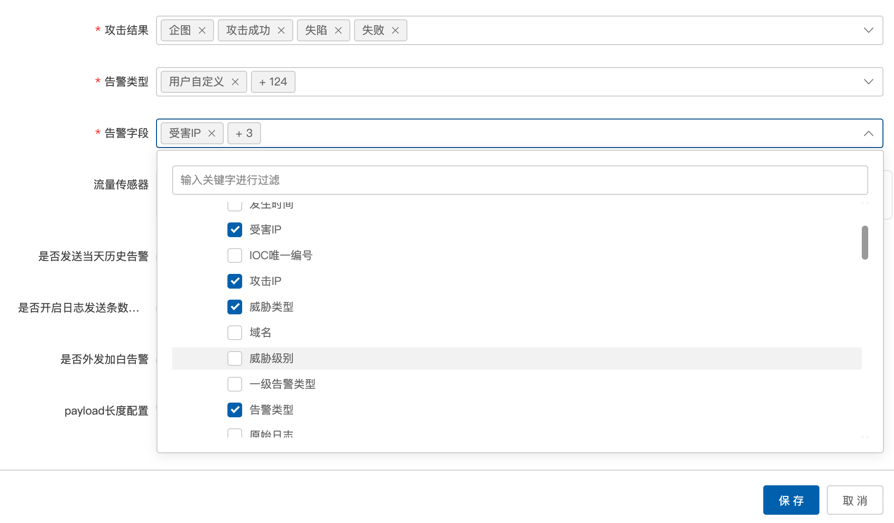

# 奇安信天眼

## 下载模块

```
wget https://raw.githubusercontent.com/sec-report/SecAutoBan/main/device/alarm/qianxin_skyeye/qianxin_skyeye.py
```

## 配置说明

### 配置天眼

天眼支持外发syslog，通过`设置`-`联动管理`-`告警联动配置`-`SYSLOG配置`，打开syslog服务开关。


新增一条配置



新增一条配置，服务器IP为本脚本运行的服务器IP，传输方式选择UDP，打开告警日志开关配置告警日志



告警字段选择如下：



配置完成后依次点击保存即可

### 安装依赖

```
pip3 install SecAutoBan ipaddress
```

### 配置模块

#### 修改回连核心模块配置

更改脚本第`43`-`45`行

```
server_ip = "127.0.0.1",
server_port = 80,
sk = "sk-xxx",
```

#### 配置syslog监听地址

更改脚本第`40`行，请与天眼SYSLOG中配置的端口一致

```
listen_syslog_udp_port = 567
```

## 运行

```shell
python3 qianxin_skyeye.py
```