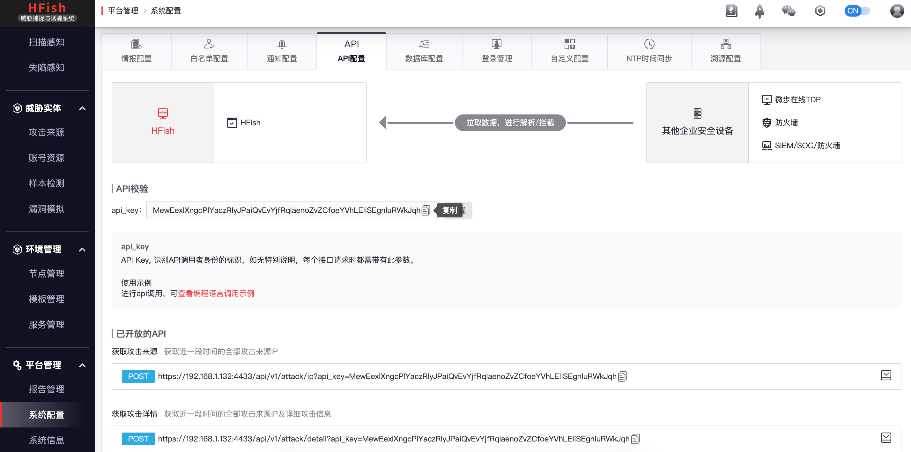

# 微步蜜罐HFish

## 下载脚本

```
wget https://raw.githubusercontent.com/sec-report/SecAutoBan/main/device/alarm/threatbook_hfish/threatbook_hfish.py
```

## 配置说明

### 安装依赖

```
pip3 install SecAutoBan requests
```

### 配置模块

#### 修改回连核心模块配置

更改脚本第`46`-`48`行

```
server_ip = "127.0.0.1",
server_port = 8080,
sk = "sk-xxx",
```

#### 配置与蜜罐连接的地址

更改脚本第`44`行

```
"url": "https://xxx.xxx.xxx.xxx:4433",
```

#### 配置`api_key`

进入`平台管理-系统配置-API配置`页面，复制api_key



更改脚本第`45`行

```
"api_key": "xxx"
```

## 运行

```shell
python3 threatbook_hfish.py
```