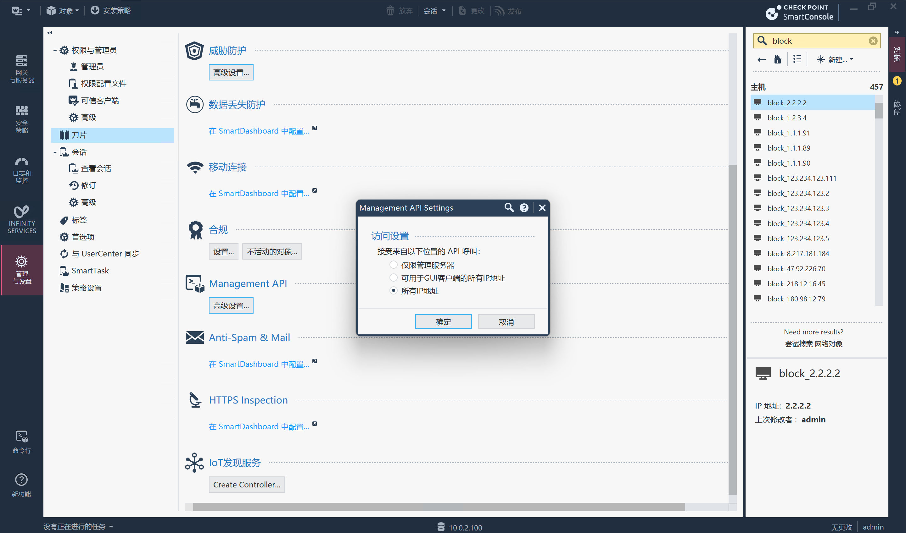
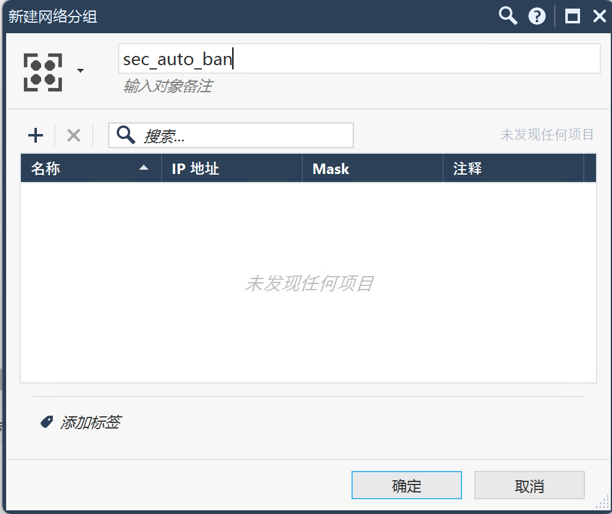
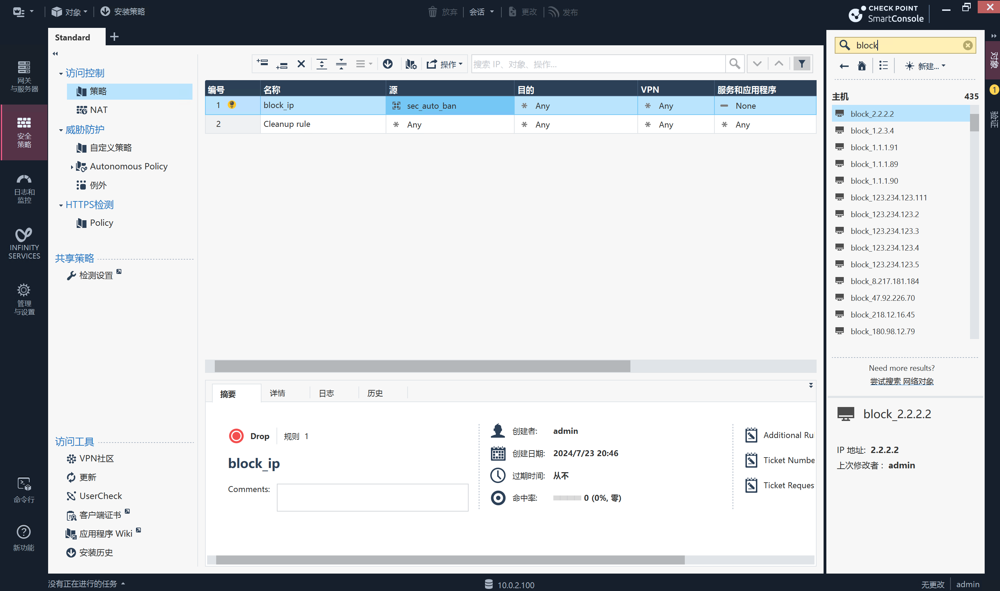

# CheckPoint

CheckPoint封禁模块

## 下载模块

```
wget https://raw.githubusercontent.com/sec-report/SecAutoBan/main/device/block/check_point/check_point.py
```

## 配置CheckPoint

### 开启Management API



### 新建网络分组

`新建-网络分组`弹出框新建分组`sec_auto_ban`并保存:



### 为网络分组创建封禁规则

在`安全策略-访问控制-策略`页面新建两条规则，分别为阻止源为`sec_auto_ban`及目的为`sec_auto_ban`，图例:



## 配置模块

### 安装依赖

```
pip3 install SecAutoBan requests
```

### 修改配置

#### 修改回连核心模块配置

更改脚本第`159`-`161`行

```
server_ip = "127.0.0.1",
server_port = 80,
sk = "sk-xxx",
```

#### 修改与CheckPoint连接的地址

更改脚本第`153`行

```
"url": "http://xxx.xxx.xxx.xxx",
```

#### 填写CheckPoint用户名密码

更改脚本第`154`-`155`行

```
"username": "admin",
"password": "",
```

## 运行

```shell
python3 check_point.py
```
