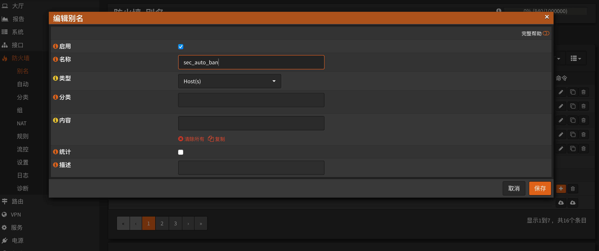
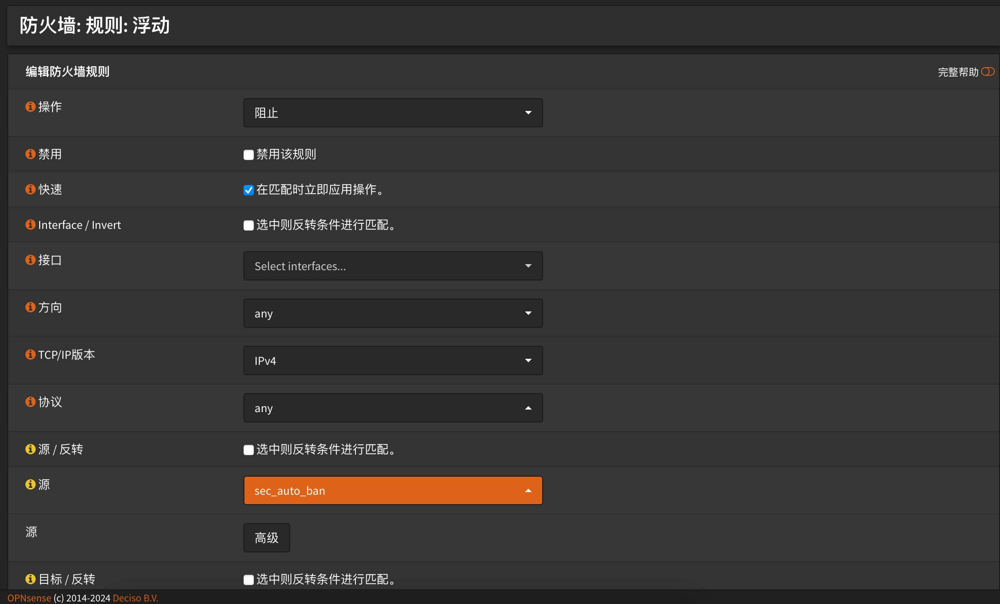

# OPNsense

OPNsense封禁模块

## 配置OPNsense

### 添加API

查看[官方文档](https://docs.opnsense.org/development/how-tos/api.html)为用户添加API密钥

### 创建别名组

在`防火墙-别名`页面新建别名`sec_auto_ban`并保存:



### 为别名组创建封禁规则

在`防火墙-规则-浮动`页面新建两条规则，分别为阻止源IP为别名组及目标IP为别名组，图例:



## 配置模块

### 安装依赖

```
pip3 install SecAutoBan requests
```

### 修改配置

#### 修改回连核心模块配置

更改脚本第`56`-`58`行

```
server_ip = "127.0.0.1",
server_port = 8080,
sk = "sk-xxx",
```

#### 修改与OPNsense连接的地址

更改脚本第`51`行

```
"url": "http://xxx.xxx.xxx.xxx",
```

#### 修改刚刚获取的OPNsense API

更改脚本第`52`-`53`行

```
"api_key": "xxx",
"api_secret": "xxx",
```

## 运行

```shell
python3 opnsense.py
```
