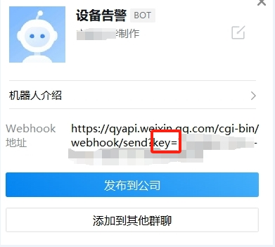

# 企业微信告警通知

本模块不会对IP进行封禁，仅作为向企业微信机器人推送通知

## 下载模块

```
wget https://raw.githubusercontent.com/sec-report/SecAutoBan/main/device/block/workweixin_robot/workweixin_robot.py
```

## 配置说明

### 安装依赖

```
pip3 install SecAutoBan
```

### 配置模块

#### 修改回连核心模块配置

更改脚本第`49`-`51`行

```
server_ip = "127.0.0.1",
server_port = 80,
sk = "sk-xxx",
```

#### 修改企业微信机器人配置

创建机器人后，记录机器人的key(key=后面的值)



更改脚本第`46`行，修改hook_key：

```
webhook = "https://qyapi.weixin.qq.com/cgi-bin/webhook/send?key="
secret = "aaaaaaaa-aaaa-aaaa-aaaa-aaaaaaaaaaaa"
```
## 运行

```shell
python3 workweixin_robot.py
```
